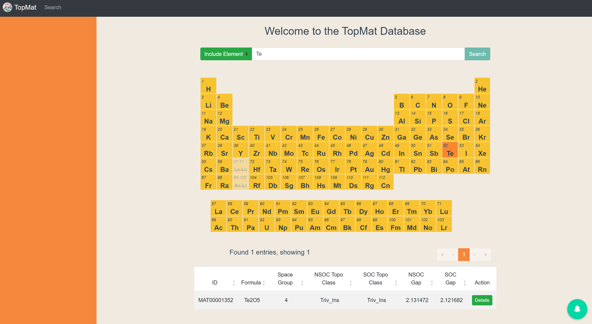
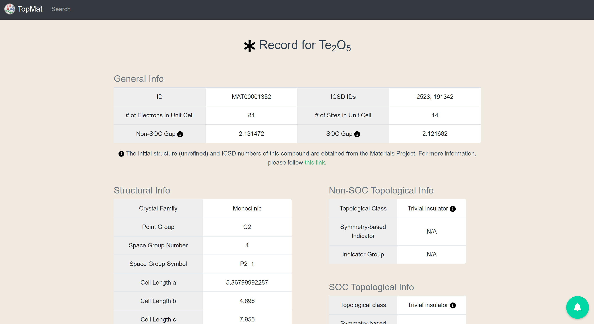
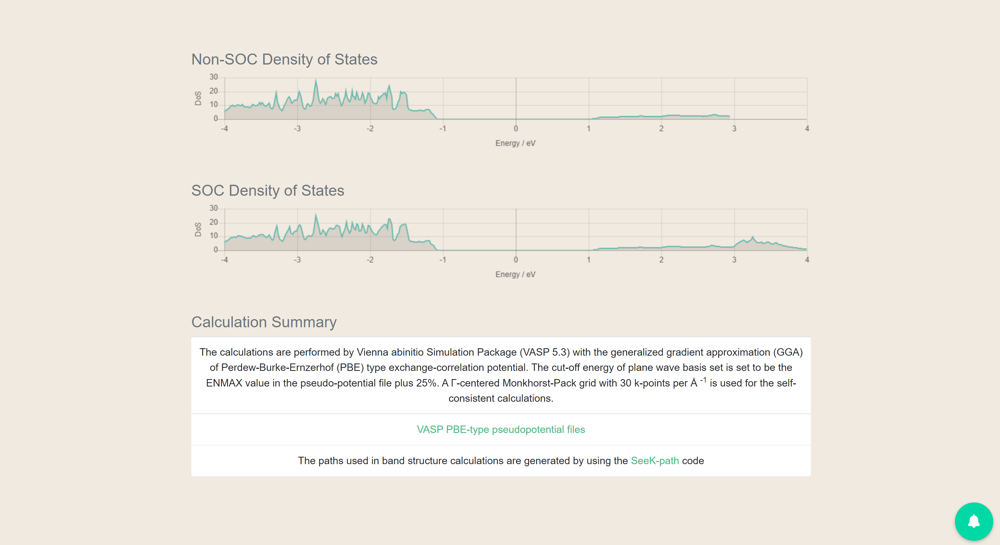

# TopMat
## 页面展示



## 项目部署

1. 安装mongo
    mongo没问题建议安装最新版，有问题安装4.4.6
   
   - [mongo官网](https://mongodb.com)

2. 导入数据
    ```sh
    mongoimport --db topmat --collection materials --file C:\XXX\XXX\data.json
    ```
    **将data.json导入mongo时必须使用mongo命令**，使用数据库工具会导致导入数据出现问题！
    使用该命令时，务必退出mongo环境！

     若mongoimport报错，需要去https://www.mongodb.com/try/download/database-tools 下载MongoDB Datebase Tools，然后将其中bin文件夹中的所有内容复制到mongo的bin文件夹下既可。[详细内容可参考此链接]( https://blog.csdn.net/weixin_44443576/article/details/120998855?utm_medium=distribute.pc_relevant.none-task-blog-2~default~baidujs_title~default-0.queryctrv4&spm=1001.2101.3001.4242.1&utm_relevant_index=3)

3. 安装NodeJS
    
	不推荐最新版本，建议使用v16.0.0
	
	设置node和npm为全局环境变量
      
   - [nodejs官网](https://nodejs.org)

4. 安装Python
	
	不推荐最新版本，建议使用v3.9.0
	
	设置python和pip为全局环境变量

	- [Python官网](https://www.python.org/)

5. 项目开发
    
	4.1 Linux & Mac 环境：
    
 	(1) navigate to web
    ```sh
        cd web
        npm install
        npm run dev
    ```
    (2) navigate to server

    ```sh
        cd server
        virtualenv venv
        source venv/bin/activate
        pip install -r requirements.txt
        edit env_dev.sh to set proper values for all environment variables
        source env_dev.sh
        flask run
    ```
    4.2 Windows 环境：
	
	(1) navigate to web
    ```sh
        cd web
        npm run dev
     ```
    (2) navigate to server
    ```sh
        cd server
        .\venv\Scripts\activate.bat
        pip install -r requirements.txt -t ./venv/Lib
        set FLASK_APP=main.py
        set FLASK_RUN_PORT=8081
        set FLASK_RUN_HOST=localhost
        set FLASK_DEBUG=1
        set APP_MAIL_PASSWORD=123456
        flask run
    ```

6. 项目URL
    ```sh
    localhost:8082
    ```

7. 项目部署
   1)  安装docker
        - [docker官网](https://www.docker.com)
   
   2)  安装node (版本最好为16.0.0)
        - [nodejs官网](https://nodejs.org)
   3)  往服务器上传代码(使用sftp工具等)
   
   4)  在docker中安装mongo
        
        执行以下命令：
        ```sh
        source createDatebase.sh
        ```

   5)  导入数据库数据

        依次执行以下命令：
        ```sh
        docker cp dump topmat_mongo:/dump
        docker exec -it topmat_mongo bash
        mongorestore 
        exit
        ```
   6)  运行部署脚本

        执行以下命令：
        ```sh
         source start.sh
        ```
        运行完成，查看docker容器是否正常启动
        执行以下命令：
        ```sh
         docker ps
        ```
        若能看到以下三个容器，即为项目正常运行
        ```sh
            IMAGE                    PORTS                                 NAMES
         topmat:web      0.0.0.0:8082->80/tcp, :::8082->80/tcp           topmat_web
         topmat:server              8081/tcp,                            topmat_server
         mongo:latest               27017/tcp,                           topmat_mongo
        ```
   7)  打开服务器8082端口
   8)  如果想删除所有该项目相关容器，可执行以下代码
        ```sh
         source RemoveAllDocker.sh
        ```